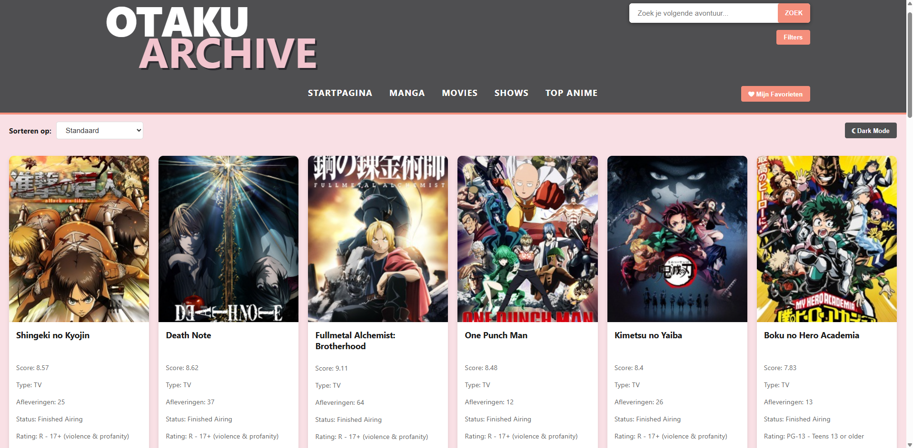
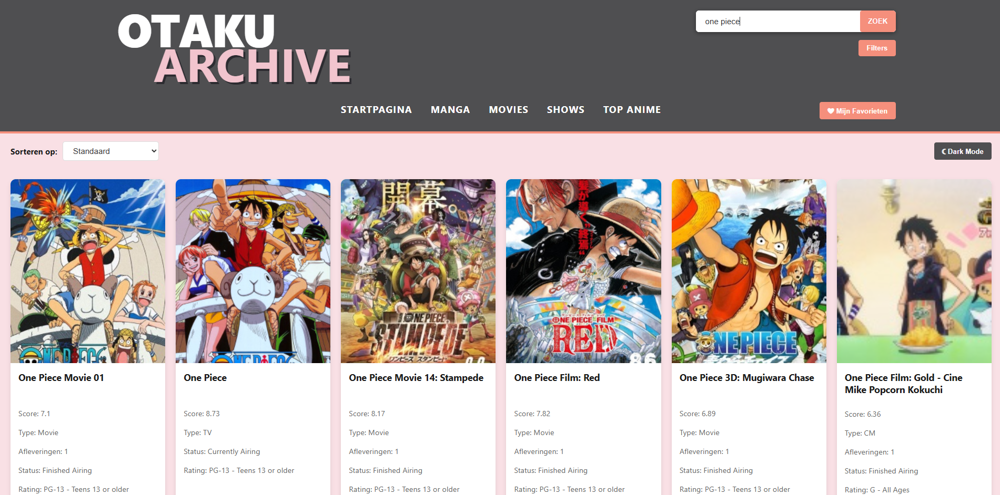
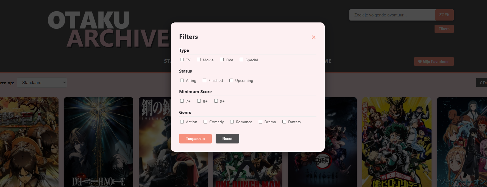
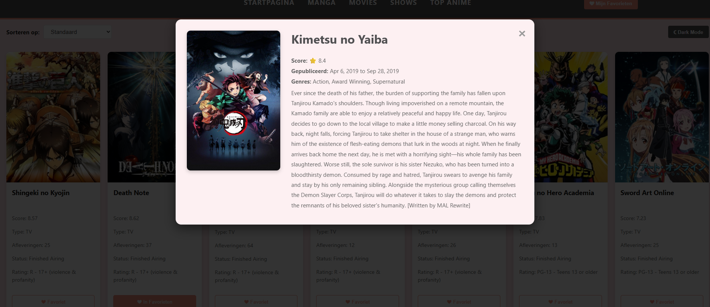

# 🏯 Otaku Archive - Web Advanced Project

Otaku Archive is een single-page webapplicatie gemaakt voor het vak Web Advanced. Het project biedt een interactieve manier om anime te ontdekken via de Jikan API. Gebruikers kunnen zoeken naar titels, resultaten filteren op type of score, en hun favoriete anime opslaan in een persoonlijke collectie die bewaard blijft tussen sessies door.

---

## 🚀 Functionaliteiten

*   **Zoeken op titel**: 
    - Vind direct specifieke anime via de zoekbalk.
*   **Filter systeem**: 
    - Filter resultaten in een pop-up op type, status, score en genre.
*   **Sorteren**: 
    - Sorteer de getoonde kaarten op titel (A-Z) of op score (hoog/laag).
*   **Thema Switcher**: 
    - Wissel tussen Light Mode en Dark Mode.
*   **Favorieten**: 
    - Sla anime op in een persoonlijke lijst met de hartjes-knop.
*   **Detail Modal**: 
    - Klik op een kaart voor een pop-up met de synopsis en genres.
*   **Responsive Design**: 
    - De layout past zich aan voor mobiel, tablet en desktop.

---

## 🌐 Gebruikte API's

*   **Jikan API**: 
    - [https://docs.api.jikan.moe/](https://docs.api.jikan.moe/)

---

## ⚙️ Implementatie van technisch vereisten

| Vereiste | Lijnnummers | Beschrijving (Waar in `main.js`?) |
| :--- | :--- | :--- |
| **Elementen selecteren** | 4, 15, 23 | `getElementById`, `querySelector` |
| **Elementen manipuleren** | 158, 169 | `createElement`, `innerHTML` |
| **Events koppelen** | 26, 75, 218 | `addEventListener` |
| **Constanten (const)** | 4-23 | Overal gebruikt voor DOM en API |
| **Template literals** | 169-180 | HTML strings met `${anime.title}` |
| **Iteratie & array methodes** | 104, 188, 283 | `forEach`, `some`, `sort`, `map` |
| **Arrow functions** | 26, 91, 233 | `() => { ... }` syntax |
| **Ternary operator** | 175, 176 | Check voor episodes/chapters |
| **Async & Await** | 98, 146 | `async function` en `await fetch()` |
| **Fetch & JSON** | 101, 102 | Data ophalen en omzetten naar JSON |
| **LocalStorage** | 211, 298 | Favorieten en thema opslaan |
| **Formulier validatie** | 218-222 | Check op lege input + rode border |
| **Styling & layout** | ✔ | CSS Grid en Dark mode styling |
| **Tooling: Vite project** | ✔ | Projectstructuur met Vite |
| **Observer API** | X | /// |

---

## 🛠️ Installatiehandleiding

Volg deze stappen om het project lokaal op te starten met Vite:

1.  **Repository klonen**: 
    - `git clone https://github.com/Mry-af7/web-advanced-project.git`
2.  **Dependencies installeren**: 
    - `npm install`
3.  **Development server starten**: 
    - `npm run dev`
4.  **Applicatie bekijken**: 
    - -> `http://localhost:5173`

---

## 🖼️ Screenshots

### Startpagina [light & dark mode]

### Zoekfunctie + Filter

### Favorieten

### Detailoverzicht

---

## 📚 Gebruikte bronnen

*   **YouTube**: 
    - Bro Code. (2023, 31 Mei). HTML & CSS Full Course for free 🌎 
        -> [Bekijk video](https://www.youtube.com/watch?v=HGTJBPNC-Gw&list=PLZPZq0r_RZOPP5Yjt6IqgytMRY5uLt4y3)
    - Coding2GO. (2024, 7 augustus). Learn CSS FlexBox in 20 Minutes (Course)
        -> [Bekijk video](https://www.youtube.com/watch?v=wsTv9y931o8)

*   **W3Schools**: 
    - Javascript Tutorial 
        -> [Documentatie](https://www.w3schools.com/js/DEFAULT.asp)
    - CSS Tutorial
        -> [Documentatie](https://www.w3schools.com/css/)

*   **Cursus Web Advanced**: 
    - voor de basisprincipes van de SPA-opdracht

## 🤖 AI Chatlog [Gemini]